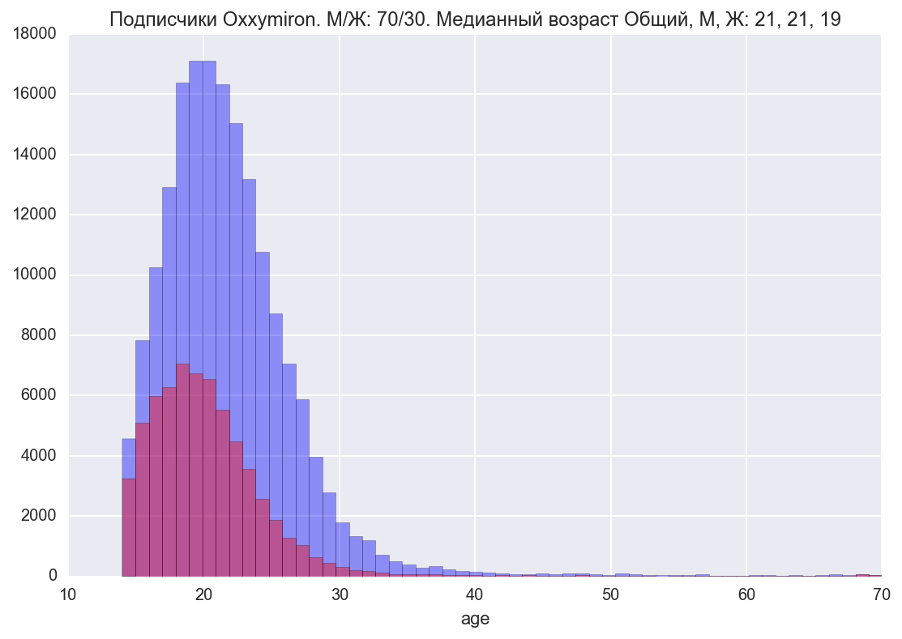
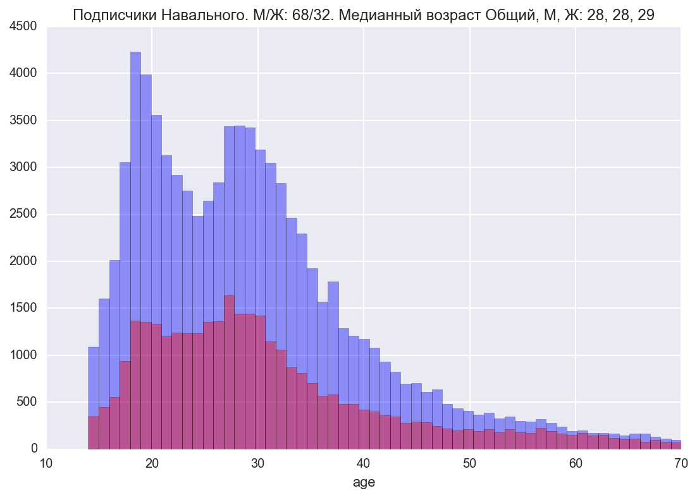
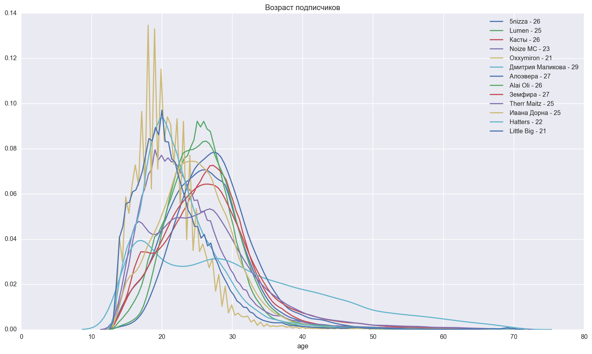
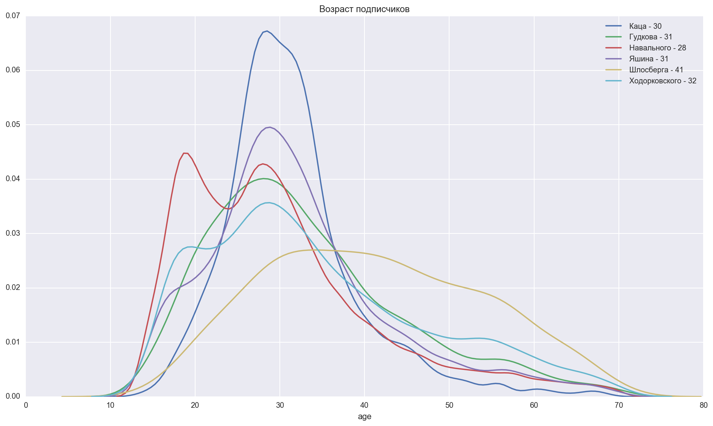
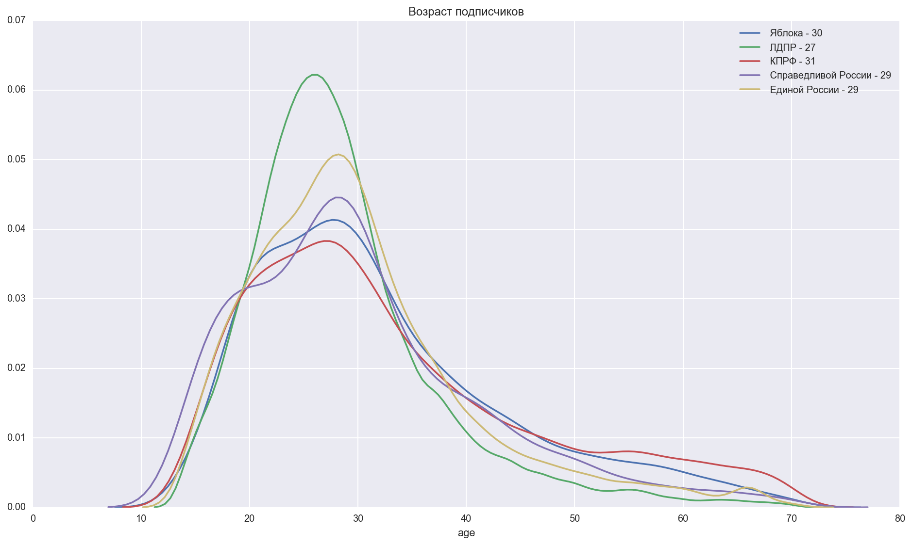

# Возраст подписчиков разных групп в VK

Просто демография разных групп. Скрипт для сбора и немного отрисовки. Вкратце:
* медианный возраст случайного человека в VK - 29 лет
* у *Oxxxymiron*'a при этом медианный возраст подписчика - 21 год
* у *Навального* - 28 лет. При этом есть 2 пика: на 19 (причём у парней) и 27 годах
* девушки в 2-3 раза реже подписываются на политику

Получаются такие графики, больше в ipynb-ноутбуке

